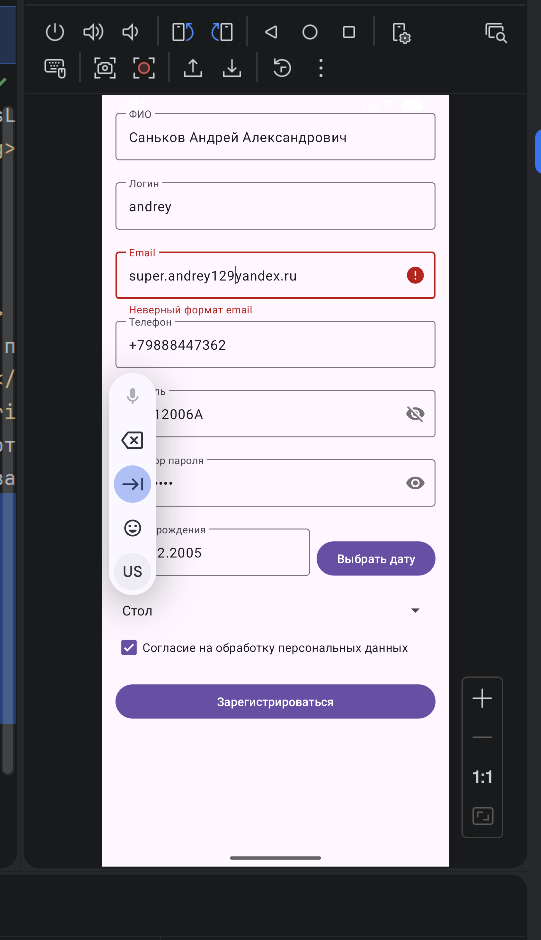

# Практическая работа №7: Локализация и списки. Формы ввода и валидация данных

**Выполнил:**  
Саньков Андрей Александрович  
Группа: ИНС-б-о-24-1  
Направление: 09.03.02 «Информационные системы и технологии»

---

## Цель работы

Изучить механизмы локализации Android-приложений, научиться работать со списками (ListView, Spinner), освоить различные типы полей ввода и реализовать валидацию пользовательского ввода с использованием регулярных выражений.

---

## Ход работы

### Задание 1. Создание проекта и локализация

Создан проект `LocalizationAndFormsLab`. В `res/values/strings.xml` определены строки `app_name` и `list_title`. Создана локализованная папка `res/values-pl/` (польский язык) с переводом строк. На главный экран добавлен `TextView`, отображающий `@string/list_title`.


**Рисунок 1** — Добавление строку для заголовка списка list_title


**Рисунок 2** — Отображение строки на польском языке

---

### Задание 2. Работа со списком ListView

В `strings.xml` создан массив строк `items_array` (список мебели). В разметку `activity_main.xml` добавлен `ListView`. В `MainActivity.java` массив получен из ресурсов, создан `ArrayAdapter`, установлен слушатель нажатий с выводом `Toast`.


**Рисунок 3** — Список мебели на русском


**Рисунок 4** — Список мебели на польском

---

### Задание 3. Создание формы регистрации

Создана `RegistrationActivity` с разметкой `activity_registration.xml`. Добавлены поля:
- ФИО (EditText)
- Логин (EditText)
- Email (EditText)
- Телефон (EditText)
- Пароль (textPassword)
- Повтор пароля (textPassword)
- Дата рождения (EditText + кнопка вызова DatePickerDialog)
- Spinner (список, загружаемый из ресурсов)
- CheckBox «Согласие на обработку данных»
- Кнопка «Зарегистрироваться»


**Рисунок 5** — Форма регистрации (заполненная)

---

### Задание 4. Реализация валидации

В обработчике кнопки реализована проверка всех полей по регулярным выражениям (согласно заданию). При ошибке поле подсвечивается через `setError()`, в Logcat выводится сообщение с тегом "Registration". При успешной валидации — `Toast` об успехе.



**Рисунок 6** — Ошибка валидации (некорректный email)

---

## Задания для самостоятельного выполнения

### 1. Локализованный список

Создан массив строк для двух языков: русский и польский (вариант 10 — список мебели). При смене языка на устройстве список в `ListView` автоматически отображается на выбранном языке.

**Русский массив (res/values/strings.xml):**
<string-array name="furniture_array">
        <item>Стол</item>
        <item>Стул</item>
        <item>Кровать</item>
        <item>Шкаф</item>
        <item>Диван</item>
        <item>Тумба</item>
    </string-array>

Польский массив (res/values-pl/strings.xml):
<string-array name="items_array">
    <item>Stół</item>
    <item>Krzesło</item>
    <item>Szafa</item>
    <item>Łóżko</item>
    <item>Kanapa</item>
    <item>Komoda</item>
    <item>Nocna szafka</item>
</string-array>

### 2. Форма регистрации с валидацией
Реализована форма со следующими полями и правилами проверки:

Поле	Регулярное выражение / правило

ФИО	^[А-Яа-яЁё\s-]+$ (кириллица, пробелы, дефис)

Логин	^[A-Za-z]+$ (латиница)

Email	^[A-Za-z0-9._%+-]+@[A-Za-z0-9.-]+\.[A-Za-z]{2,}$

Телефон	^\+7\d{10}$ (формат +7XXXXXXXXXX)

Пароль	минимум 6 символов, хотя бы одна цифра и одна заглавная буква

Повтор пароля	совпадение с паролем

Дата рождения	^(0[1-9]|[12][0-9]|3[01])\.(0[1-9]|1[012])\.(19|20)\d{2}$, не ранее 1900 и не позже текущей даты

Spinner	выбор из списка мебели (обязательный выбор)

CheckBox	согласие на обработку данных (обязательно)


### 3 Реализация выбора даты рождения через диалоговое окно DatePickerDialog


**Рисунок 6** — Выбор даты через диалоговое окно

# Контрольные вопросы
### 1. Как создать локализованные строки для другого языка? Где хранятся такие ресурсы?
Нужно создать папку-квалификатор, например res/values-ru/ для русского языка, и внутри неё файл strings.xml с теми же ключами, но переведёнными значениями. Для польского — values-pl/. Система автоматически подгружает ресурсы в зависимости от языка устройства.

### 2. Что такое ArrayAdapter? Для чего он используется вместе с ListView?
ArrayAdapter — это адаптер, который связывает массив данных (или список) с ListView. Он отвечает за создание вида каждого элемента списка и отображение данных.

### 3. Как обработать нажатие на элемент ListView? Приведите фрагмент кода.

''' listView.setOnItemClickListener(new AdapterView.OnItemClickListener() {
    @Override
    public void onItemClick(AdapterView<?> parent, View view, int position, long id) {
        String selected = parent.getItemAtPosition(position).toString();
        Toast.makeText(MainActivity.this, selected, Toast.LENGTH_SHORT).show();
    }
});'''
4. Какие типы полей ввода (inputType) вы знаете? Перечислите не менее 5.
text — обычный текст.

textEmailAddress — email.

textPassword — пароль (скрытые символы).

phone — телефонный номер.

number — целое число.

numberDecimal — число с плавающей точкой.

textMultiLine — многострочный текст.

5. Что такое регулярное выражение? Приведите пример проверки номера телефона.
Регулярное выражение (regex) — это шаблон для поиска и проверки строк.
Пример для телефона в формате +7XXXXXXXXXX:
^\\+7\\d{10}$
В Java: phone.matches("^\\+7\\d{10}$").

6. Как открыть DatePickerDialog? Кратко опишите шаги.
Получить экземпляр Calendar с текущей датой.

Создать DatePickerDialog, передав контекст, слушатель и год/месяц/день.

Вызвать show().

Пример:

```
Calendar cal = Calendar.getInstance();
new DatePickerDialog(this, (view, year, month, day) -> {
    String date = day + "." + (month+1) + "." + year;
    editText.setText(date);
}, cal.get(Calendar.YEAR), cal.get(Calendar.MONTH), cal.get(Calendar.DAY_OF_MONTH)).show();``` 
7. Как отобразить выпадающий список (Spinner) с данными из ресурсов? Напишите код.
java
Spinner spinner = findViewById(R.id.spinner);
ArrayAdapter<CharSequence> adapter = ArrayAdapter.createFromResource(this,
        R.array.items_array, android.R.layout.simple_spinner_item);
adapter.setDropDownViewResource(android.R.layout.simple_spinner_dropdown_item);
spinner.setAdapter(adapter);
8. В чем разница между CheckBox и RadioGroup? Когда какой элемент использовать?
CheckBox — позволяет выбрать несколько независимых вариантов.

RadioGroup (группа радиокнопок) — позволяет выбрать только один вариант из нескольких. Используется, когда варианты взаимно исключают друг друга.


При ошибке валидации поле подсвечивается setError(), в Logcat выводится сообщение с тегом Registration.
